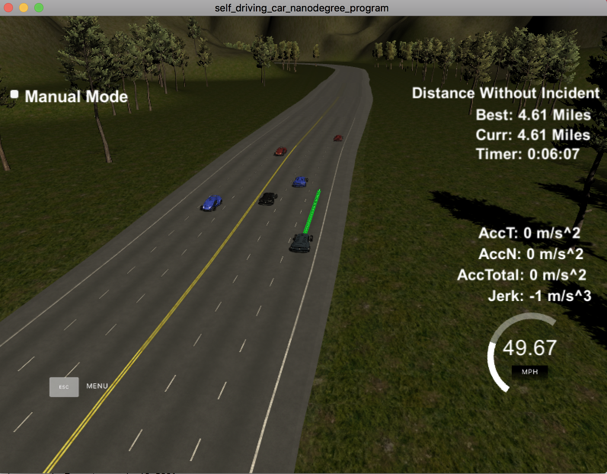

# Path Planning Project - Udacity Self Driving Car Nanodegree - Term 3

## Reflection on how to generate paths **

As required in the rubrics, this documentation gives a brief overview over the approach chosen in this project to generate paths.

I used the approach of the Q&A project walkthrough. This approach (see `main.cpp`, lines 507 - 622) generates paths via the following steps:

- Generate two waypoints either from previous path or from the cars actual position.
- Add additional three waypoints evenly 30m spaced in the target lane ahead of starting reference.
- Shift these five points to the car coordinates and use them to create a spline.
- Take all remaining waypoints from the previous path and put them to the output-path (this ensures continuity).
- Fill up the rest of the output-path up to 50 waypoints using the target speed and target lane in combination with the generated spline. Remark: Take care to shift points, generated with help of the spline, back to map coordinates before adding them to the output-path.

To set the target speed a check was implemented (see `main.cpp`, lines 292 - 351), that checks distance for cars in front of us in the same lane. If the distance dropped below a certain threshold, the target speed was lowered depending on distance and speed difference to the car in front. And the lane change algorithm was enabled.

The lane change approach (see `main.cpp`, lines 353 - 498) sets desired target lane and is running through the following steps:
- check, if lane left or right to the car is blocked and find minimum speed of all cars in front of us in the respective lane
- if both lanes are free, switch to the lane with higher minimum speed (only if that is higher, than in current lane)
- if only one lane is free, switch to this lane (only if minimum speed in that lane is higher than in current lane)
- otherwise stay in the current lane

**Proof of making 4.23 miles:**

